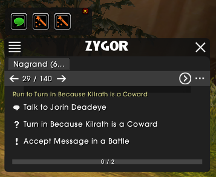
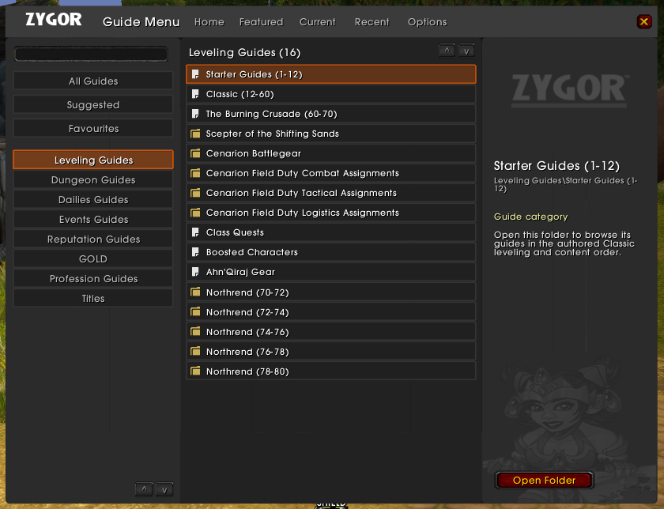

# ZygorPlus - WoW classic guide viewer backport

ZygorPlus is a guide-viewer port for World of Warcraft 3.3.5a (build 12340).
Each release contains the viewer plus Common, Alliance, Horde, and legacy
talent-settings bridge addons.

The current alpha prerelease is intended for real-client testing and feedback.
Expect unfinished features; please report reproducible problems with the exact
release tag, your client build, enabled addons, active guide, and Zygor
diagnostics report.

## Installation

1. Download the latest ZIP from the [GitHub Releases page](https://github.com/RovxBot/ZygorPlus/releases).
2. Extract all five folders into your WoW 3.3.5a `Interface/AddOns` directory:

   - `ZygorGuidesViewer`
   - `ZygorGuidesViewer_GuidesAlliance`
   - `ZygorGuidesViewer_GuidesHorde`
   - `ZygorGuidesViewer_GuidesCommon`
   - `ZygorTalentAdvisor`

## Development

This backport is actively developed. You can contribute through pull requests
or issues in the [GitHub repository](https://github.com/RovxBot/ZygorPlus).

